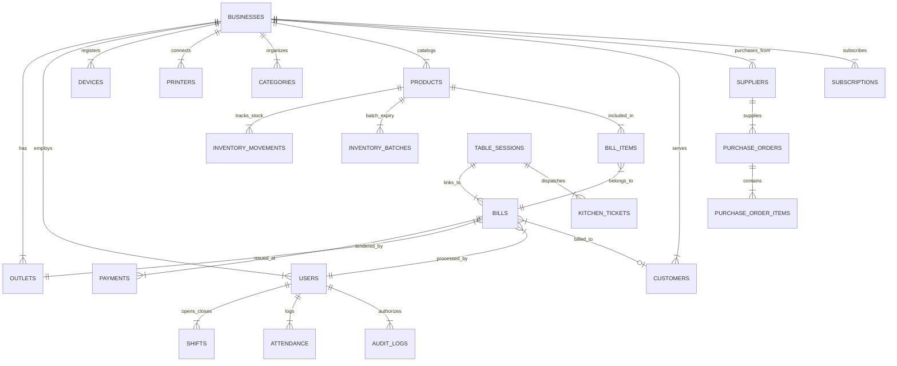

# 05 - Production Database Specification & Relational Schema Engine [v1.0 FROZEN SPECIFICATION]

## Purpose
This document defines the complete production database specification for **Optix**. It specifies every production table, entity relationship, primary key strategy (UUIDv7), foreign key constraints, composite index rationales, immutable inventory movement ledgers, payment tender schemas, soft-delete rules, synchronization metadata, money rounding policies, multi-store transfer reconciliation, receipt snapshots, data retention policies, and zero-downtime migration protocols for PostgreSQL 16 and SQLite Room.

---

## Goals
1. Provide an exhaustive, implementation-ready database specification covering all 27 production tables across cloud PostgreSQL 16 and client Android Room SQLite databases.
2. Establish **UUIDv7 Time-Ordered Primary Keys** to ensure high B-Tree index locality, sequential insert performance, and global chronological sorting.
3. Enforce an **Immutable Inventory Ledger Strategy** (`inventory_movements` table) tracking every stock addition, deduction, wastage write-off, purchase inwarding, and multi-store dual-movement transfer (`transfer_id`).
4. Implement **Receipt Line Item Snapshots** (`product_name_snapshot`, `sku_snapshot`, `tax_name_snapshot`, `tax_rate_snapshot`, `discount_snapshot`) to guarantee historical receipts remain permanently immutable.
5. Define explicit **Money & Tax Rounding Policies** using Banker's Rounding (`HALF_EVEN`) and internationalization attributes (`currency_symbol`, `decimal_precision`, `thousand_separator`, `locale`).
6. Establish operational policies: Range Partitioning, Data Retention (90-day sync purge, 1-year audit logs), Optimistic Concurrency controls, and Categorized Seeding.

---

## Technical Dependencies & Stack

- **Cloud Database Engine**: PostgreSQL 16+, Prisma ORM 5.10+, pgBouncer pool manager.
- **Client Embedded Engine**: Room Database 2.6+, SQLite 3.40+, SQLCipher for Android 4.5+ (AES-256).
- **Primary Key Strategy**: UUIDv7 (Time-ordered 128-bit identifiers).
- **Precision Standards**:
  - Monetary fields: `NUMERIC(12,4)` (4-decimal place storage, rounded to 2 decimal places for tender display via `HALF_EVEN`).
  - Mass/Volume fields: `NUMERIC(12,3)` (e.g., `1.845 kg`).

---

## Complete Entity Relationship Diagram (ERD)



---

## Standardized Entity Metadata Specifications

Every syncable table in PostgreSQL and Room SQLite incorporates standard audit and sync metadata:

```prisma
// Standard Synchronization & Soft-Delete Mixin Template
model SyncMetadataMixin {
  createdAt        DateTime  @default(now()) @map("created_at") @db.Timestamptz
  updatedAt        DateTime  @updatedAt @map("updated_at") @db.Timestamptz
  deletedAt        DateTime? @map("deleted_at") @db.Timestamptz // Soft-delete marker
  versionTimestamp BigInt    @map("version_timestamp") // Monotonic epoch ms for sync
  deviceId         String    @map("device_id") @db.VarChar(100)
}
```

- **Soft-Delete Policy**: Entities are never hard-deleted if referenced in transaction histories. Deletion updates `deleted_at = CURRENT_TIMESTAMP`. Active queries filter `WHERE deleted_at IS NULL`.
- **Optimistic Concurrency Control**: Any modification updates `version_timestamp = NOW_EPOCH_MS()`. If incoming sync `version_timestamp` is less than server state, server flags conflict for resolution.

---

## Master Production Entities (27 Entities)

### 1. Business & Currency Specs (`businesses`)
- `id`: UUID (v7 Primary Key)
- `name`: VARCHAR(255) NOT NULL
- `business_type`: ENUM (`RESTAURANT`, `CHICKEN_SHOP`, `BAKERY`, `MEDICAL`, `RETAIL`, `SALON`)
- `currency_code`: VARCHAR(3) DEFAULT 'USD'
- `currency_symbol`: VARCHAR(5) DEFAULT '$'
- `decimal_precision`: INT DEFAULT 2
- `thousand_separator`: VARCHAR(1) DEFAULT ','
- `locale`: VARCHAR(10) DEFAULT 'en_US'
- `time_zone`: VARCHAR(50) DEFAULT 'UTC'
- `is_active`: BOOLEAN DEFAULT true

---

### 2. Multi-Store Inventory Transfers & Dual Movement Ledger (`inventory_movements`)

When stock is transferred between Outlet A (Source) and Outlet B (Destination):
- **Movement 1 (OUT)**: Deducts stock from Outlet A (`quantity: -50`, `movement_type: BRANCH_TRANSFER_OUT`, `reference_id: transfer-9022`).
- **Movement 2 (IN)**: Adds stock to Outlet B (`quantity: +50`, `movement_type: BRANCH_TRANSFER_IN`, `reference_id: transfer-9022`).
- Both movements are linked by the shared `transfer_id` for automated double-entry reconciliation.

---

### 3. Receipt Immutable Line Item Snapshots (`bill_items`)

To guarantee historical receipts never change even if products, taxes, or discounts are modified later:
- `bill_id`: UUID (FK -> `bills.id`)
- `product_id`: UUID (FK -> `products.id` NULLABLE)
- `product_name_snapshot`: VARCHAR(255) NOT NULL
- `sku_snapshot`: VARCHAR(100) NULLABLE
- `unit_price`: NUMERIC(12,4) NOT NULL
- `quantity`: NUMERIC(12,3) NOT NULL
- `line_total`: NUMERIC(12,4) NOT NULL
- `tax_name_snapshot`: VARCHAR(50) DEFAULT 'VAT 10%'
- `tax_rate_snapshot`: NUMERIC(5,2) DEFAULT 10.00
- `discount_amount_snapshot`: NUMERIC(12,4) DEFAULT 0.0000

---

## Table Partitioning & Data Retention Policies

### 1. Database Table Partitioning Strategy
When table row counts cross 10 million rows, PostgreSQL range partitioning will be applied:
- **`bills` & `bill_items`**: Range partitioned by month on `created_at` (`bills_2026_07`, `bills_2026_08`).
- **`inventory_movements`**: Partitioned by `business_id` hash partitions for high-throughput merchants.
- **`audit_logs`**: Range partitioned by year on `created_at`.

### 2. Operational Data Retention Rules
- **Outbox Sync Events (`outbox_events`)**: Synced events older than **90 days** are purged via background `cleanup-worker`.
- **Audit Logs (`audit_logs`)**: Retained for **1 year** in active database; archived to S3 Cold Glacier storage thereafter.
- **In-App Notifications (`notifications`)**: Retained for **30 days** before automated deletion.
- **Soft-Deleted Entities**: Retained for **1 year** before cold storage archiving.

---

## Categorized Seeding Strategy (`database/seeds/`)

1. **`system-required-seeds.ts`**: Populates RBAC permissions matrix, system roles, default tax profiles, and vertical module metadata (Executed on production deploy).
2. **`demo-seeds.ts`**: Populates sample bakery and retail store product catalogs, demo customers, and historical bills (Used for merchant demo instances).
3. **`dev-fixtures.ts`**: Populates 1,000 synthetic test products and users for local developer benchmarking.

---

## Money Rounding & Calculation Rules

- **Storage**: `NUMERIC(12,4)` (4-decimal place storage).
- **Display & Payment**: Banker's Rounding (`HALF_EVEN` / `ROUND_HALF_EVEN`) to 2 decimal places:
  $$\text{Final Payable Amount} = \text{HALF\_EVEN}(\text{subtotal} + \text{tax\_total} - \text{discount\_total}, 2)$$

---

## Frozen Specification Sign-Off
- **Status**: FROZEN (v1.0)
- **Tag**: `v1.0-database-specification-freeze`
